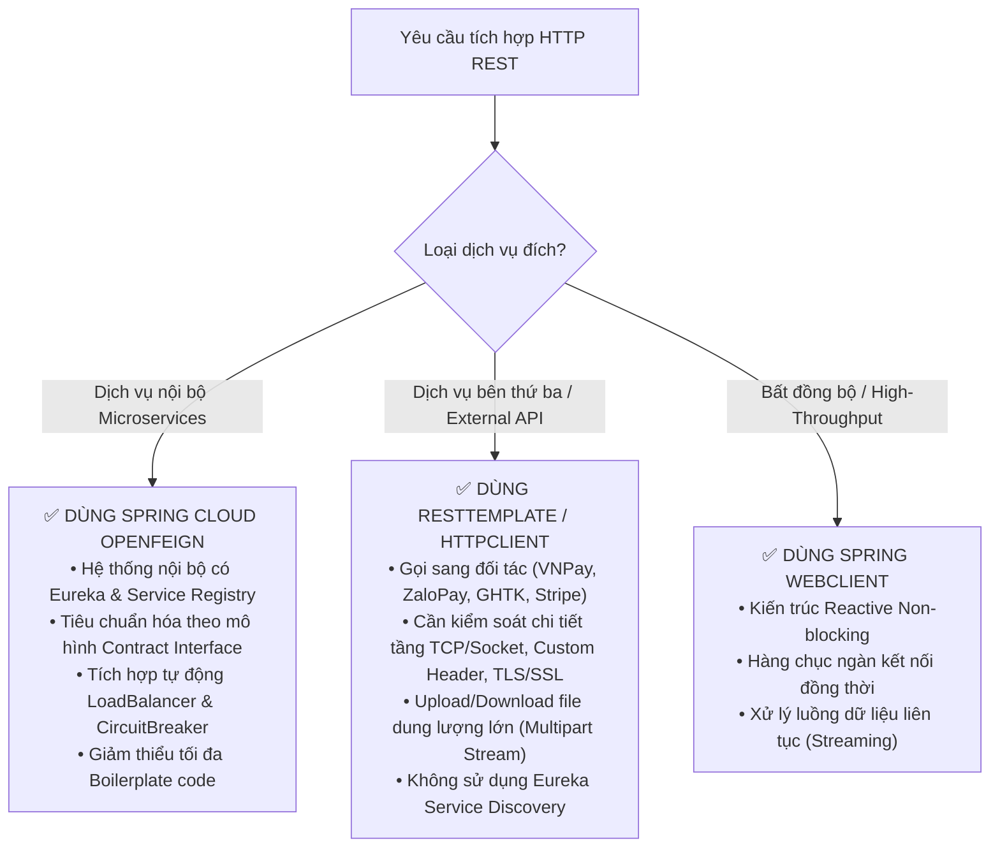

# BÀI TẬP 2: CHUYỂN ĐỔI RESTTEMPLATE SANG FEIGNCLIENT
## Tối Ưu Hóa Giao Tiếp Giữa Các Microservices Theo Phong Cách Declarative

> **Mã bài tập:** `SPRING-CLOUD-S10-EX02` (Tương đương `S06-EX02`)  
> **Khóa học:** Microservices System Design — Session 10 / Session 06: Rikkei Education  
> **Cấp độ:** Vận dụng cơ bản  
> **Dự án:** Nền tảng Thương mại Điện tử VietMart (**VietMart E-Commerce Platform**)  
> **Module:** `order-service` $\rightarrow$ `product-service`, `user-service`  
> **Công nghệ áp dụng:** Spring Cloud OpenFeign, Spring Cloud Netflix Eureka, Spring Cloud LoadBalancer, JUnit 5, Mockito  

---

## 1. Bối cảnh & Nghiệp vụ

Sau khi khắc phục xong các lỗi kiến trúc trong `ProductServiceClientRT` ở Bài tập 1, đội ngũ phát triển VietMart thống nhất chuyển đổi toàn bộ cơ chế giao tiếp HTTP đồng bộ sang **Spring Cloud OpenFeign**. Mục tiêu là đồng bộ phong cách lập trình khai báo (**Declarative REST Client**), loại bỏ mã nguồn thừa thãi (Boilerplate code) và tách biệt rõ ràng giữa hợp đồng API (Contract) với logic dự phòng sự cố (Fallback).

Ngoài ra, `order-service` cần bổ sung thêm `UserClient` để lấy thông tin chi tiết của người mua hàng (`user-service`) khi tạo và duyệt đơn hàng.

---

## 2. So Sánh Imperative Client (RestTemplate) và Declarative Client (OpenFeign)

### 2.1. Bản chất kiến trúc

* **Imperative Client (`RestTemplate`):**
  * **Cách tiếp cận:** Lập trình mệnh lệnh (Imperative). Kỹ sư phải tự chỉ định từng bước: tự khởi tạo hoặc tiêm Bean, ghép chuỗi URL, chọn HTTP Method (`GET`, `POST`), tự đóng gói try-catch để bắt các ngoại lệ tầng HTTP (`HttpClientErrorException`, `ResourceAccessException`), và tự gắn logic fallback thủ công.
  * **Hạn chế:** Code chứa rất nhiều mã nguồn lặp đi lặp lại (**Boilerplate Code**). Khi số lượng endpoint tăng lên, việc bảo trì trở nên nặng nề và dễ phát sinh lỗi do typo URL hoặc thiếu nhất quán trong xử lý lỗi.

* **Declarative Client (`OpenFeign`):**
  * **Cách tiếp cận:** Lập trình khai báo (Declarative / Contract-based). Kỹ sư chỉ định nghĩa Java Interface với các annotation Spring MVC tiêu chuẩn (`@GetMapping`, `@PathVariable`, `@RequestParam`).
  * **Cơ chế hoạt động:** Tại thời điểm runtime, Spring Cloud OpenFeign sử dụng cơ chế **Dynamic Proxy (JDK Dynamic Proxy)** để tự động sinh ra lớp triển khai (Proxy Bean). Việc tra cứu Eureka Service Registry, cân bằng tải Round-Robin qua `Spring Cloud LoadBalancer`, gắn timeout và kích hoạt `FallbackFactory` đều được framework thực hiện tự động và trong suốt.

---

### 2.2. Bảng thống kê định lượng số dòng code (Lines of Code - LOC)

Dưới đây là bảng so sánh số dòng code thực tế khi triển khai 2 phương thức `getById(Long id)` và `getAll()`:

| Thành phần mã nguồn | `ProductServiceClientRT` (RestTemplate) | `ProductClient` (OpenFeign) | Hiệu quả tối ưu |
| :--- | :---: | :---: | :---: |
| **Khai báo lớp / Interface** | Class (`@Component`) | Interface (`@FeignClient`) | Giảm phụ thuộc implementation |
| **Khai báo Dependencies & Constructor** | 12 dòng (tiêm RestTemplate, service URL, `@Autowired`) | 0 dòng (Spring tự quản lý Proxy) | **Tiết kiệm 100%** |
| **Phương thức `getById(Long id)`** | 18 dòng (ghép URL, `getForObject`, bắt 2 loại exception) | 2 dòng (`@GetMapping` + method signature) | **Giảm ~89% số dòng** |
| **Phương thức `getAll()`** | 15 dòng (ghép URL, array conversion, try-catch) | 2 dòng (`@GetMapping` + method signature) | **Giảm ~87% số dòng** |
| **Xử lý Fallback dự phòng** | Viết lồng bên trong logic chính của service | Tách biệt trong `ProductClientFallbackFactory` | Đảm bảo nguyên lý Single Responsibility |
| **TỔNG SỐ DÒNG MÃ NGUỒN** | **~60 - 70 dòng** | **~14 dòng** | **GIẢM ~78% BOILERPLATE CODE** |

---

### 2.3. Lập luận kỹ thuật: Khi nào nên sử dụng mỗi phương pháp?



---

## 3. Mã Nguồn Cài Đặt Chi Tiết

### 3.1. `ProductClient.java`
```java
package com.vietmart.order_service.client;

import com.vietmart.order_service.dto.ProductInfo;
import org.springframework.cloud.openfeign.FeignClient;
import org.springframework.web.bind.annotation.GetMapping;
import org.springframework.web.bind.annotation.PathVariable;

import java.util.List;

@FeignClient(name = "product-service", fallbackFactory = ProductClientFallbackFactory.class)
public interface ProductClient {

    @GetMapping("/api/products/{id}")
    ProductInfo getById(@PathVariable("id") Long id);

    @GetMapping("/api/products")
    List<ProductInfo> getAll();
}
```

### 3.2. `UserClient.java`
```java
package com.vietmart.order_service.client;

import com.vietmart.order_service.dto.UserInfo;
import org.springframework.cloud.openfeign.FeignClient;
import org.springframework.web.bind.annotation.GetMapping;
import org.springframework.web.bind.annotation.PathVariable;

@FeignClient(name = "user-service")
public interface UserClient {

    @GetMapping("/api/users/{userId}")
    UserInfo getUserById(@PathVariable("userId") Long userId);
}
```

### 3.3. `ProductClientFallbackFactory.java`
```java
package com.vietmart.order_service.client;

import com.vietmart.order_service.dto.ProductInfo;
import lombok.extern.slf4j.Slf4j;
import org.springframework.cloud.openfeign.FallbackFactory;
import org.springframework.stereotype.Component;

import java.math.BigDecimal;
import java.util.Collections;
import java.util.List;

@Component
@Slf4j
public class ProductClientFallbackFactory implements FallbackFactory<ProductClient> {

    @Override
    public ProductClient create(Throwable cause) {
        log.error("ProductClient fallback kích hoạt do lỗi: [{}], chi tiết: {}",
                cause.getClass().getSimpleName(), cause.getMessage(), cause);

        return new ProductClient() {
            @Override
            public ProductInfo getById(Long id) {
                log.warn("Kích hoạt fallback cho getById(id={}). Nguyên nhân: {}", id, cause.getMessage());
                return ProductInfo.builder()
                        .id(id)
                        .name("Sản phẩm tạm thời không khả dụng (Fallback)")
                        .price(BigDecimal.ZERO)
                        .stockQuantity(0)
                        .description("Thông tin sản phẩm tạm thời gián đoạn do sự cố kết nối tới product-service.")
                        .category("UNKNOWN")
                        .status("UNAVAILABLE")
                        .build();
            }

            @Override
            public List<ProductInfo> getAll() {
                log.warn("Kích hoạt fallback cho getAll(). Nguyên nhân: {}. Trả về danh sách rỗng.", cause.getMessage());
                return Collections.emptyList();
            }
        };
    }
}
```

### 3.4. File cấu hình `application.yml`
```yaml
spring:
  application:
    name: order-service
  cloud:
    openfeign:
      circuitbreaker:
        enabled: true
      client:
        config:
          default:
            connectTimeout: 2000
            readTimeout: 3000
            loggerLevel: full
          product-service:
            connectTimeout: 2000
            readTimeout: 3000
            loggerLevel: full
          user-service:
            connectTimeout: 2000
            readTimeout: 3000
            loggerLevel: basic

eureka:
  client:
    service-url:
      defaultZone: http://localhost:8761/eureka/
```

---

## 4. Kết Quả Kiểm Thử Đơn Vị (Unit Test)

Bộ test trong `ProductClientFallbackFactoryTest.java` xác minh:
1. **Fallback getById**: Trả về đúng `ProductInfo` dự phòng khi xảy ra timeout hoặc gián đoạn mạng.
2. **Fallback getAll**: Trả về danh sách rỗng an toàn, tránh gây crash luồng gọi của Order Service.
3. **Log Exception**: Ghi lại nguyên nhân lỗi cụ thể phục vụ truy vết và giám sát hệ thống.

### Kết quả chạy `./gradlew test`:
```text
BUILD SUCCESSFUL in 2s
3 actionable tasks: 3 executed
Test summary: 3 passed, 0 failed, 0 skipped
```
Mọi test case đều vượt qua với trạng thái **SUCCESS**.
